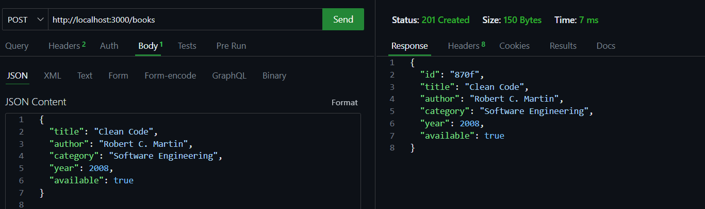
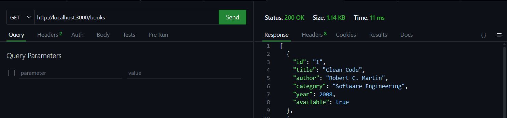
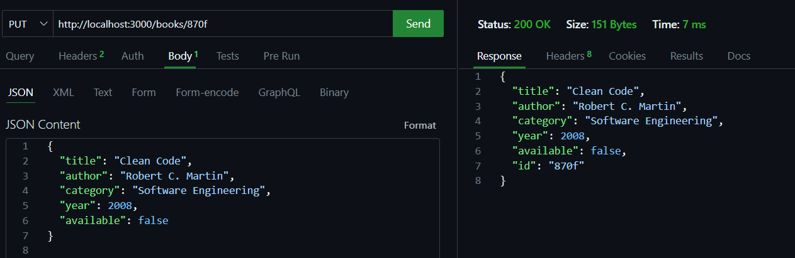
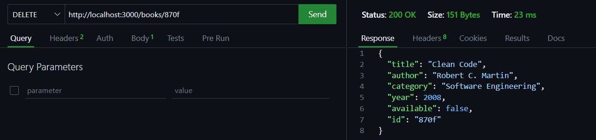
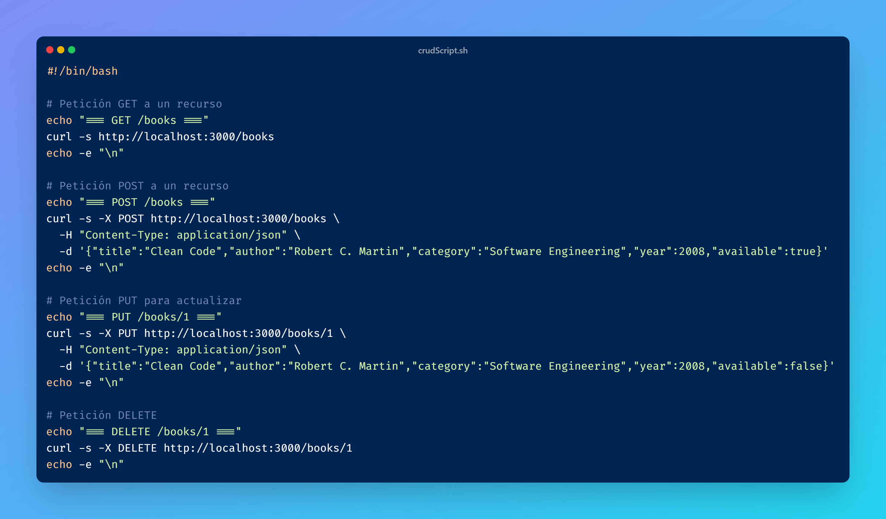

# Proyecto CRUD Básico con API REST

Este proyecto demuestra la implementación y prueba de operaciones **CRUD** (Crear, Leer, Actualizar, Borrar) sobre una API REST simple. La verificación de los endpoints se realiza de dos maneras:

1.  **Manualmente**: A través de la extensión de VS Code **Thunder Client**.
2.  **Automáticamente**: Mediante un script de shell (`.sh`) que utiliza **cURL**.

## Prerrequisitos

Para poder ejecutar y verificar este proyecto, necesitarás:

* Node.js (v18.x o superior).
* `npm` (gestor de paquetes de Node.js).
* Visual Studio Code.
* La extensión [Thunder Client](https://www.thunderclient.com/) instalada en VS Code.
* Una terminal de línea de comandos (como Git Bash, WSL, o la terminal integrada de macOS/Linux).

## ✅ Checklist de Verificación
### Ejercicio 1: Pruebas con Thunder Client

* [x] **CREATE (POST)**: Crear un nuevo recurso.
    * **Método**: `POST`
    * **URL**: `http://localhost:3000/books`
    * **Resultado esperado**: Status `201 Created` y el objeto creado con un `id`.

    

* [x] **READ (GET)**: Leer todos los recursos para confirmar la creación.
    * **Método**: `GET`
    * **URL**: `http://localhost:3000/books`
    * **Resultado esperado**: Status `200 OK` y un array que contiene el post recién creado.

    
    

* [x] **UPDATE (PUT)**: Actualizar el recurso recién creado.
    * **Método**: `PUT`
    * **URL**: `http://localhost:3000/books/<ID_DEL_POST_CREADO>`
    * **Resultado esperado**: Status `200 OK` y el objeto actualizado.

    

* [x] **DELETE (DELETE)**: Eliminar el recurso.
    * **Método**: `DELETE`
    * **URL**: `http://localhost:3000/books/<ID_DEL_POST_CREADO>` 
    * **Resultado esperado**: Status `200 OK` y el objeto que se elimino.

    

---

### Ejercicio 2: Scripting con CURL

Este ejercicio valida la creación de un script (`peticiones_http.sh`) y su ejecución a través de `npm`.

* [x] **Crear el script `scripts/peticiones_http.sh`**.
   

* [x] **Añadir el comando en `package.json`**.

* [x] **Ejecutar el script y verificar la salida**.

