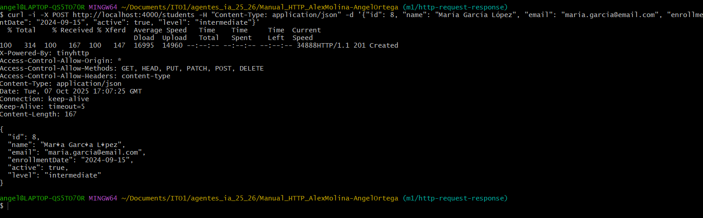
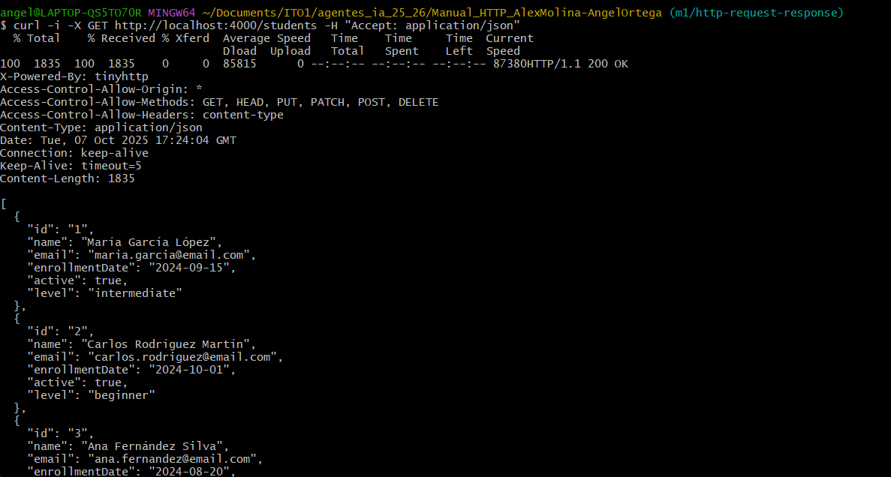
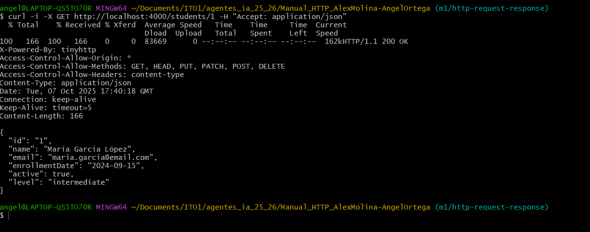
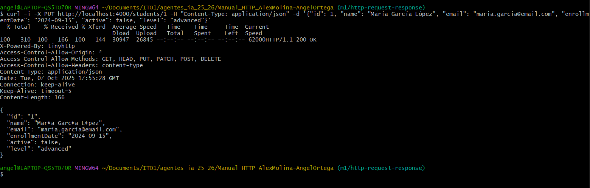
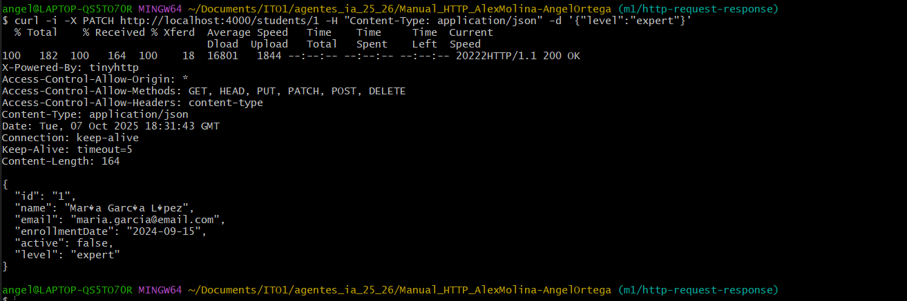
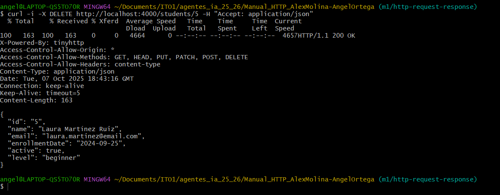

# Documentación CRUD con cURL

## 1. CREATE- Crear un nuevo recurso.
### Titulo
CREATE — Crear un nuevo recurso en una API
### Descripción
Esta operación sirve para crear un nuevo recurso en el servidor.
Por ejemplo, podría ser un nuevo usuario, producto, tarea, etc.
### Comando cURL
```bash
curl -X POST http://localhost:4000/students \
-H "Content-Type: application/json" \
-d "{"id": 8, "name": "María García López", "email": "maria.garcia@email.com", "enrollmentDate": "2024-09-15", "active": true, "level": "intermediate"}"
```
### Explicación detallada de cada parte del comando
| Flag | Significado                                                  | Uso                                            |
| ---- | ------------------------------------------------------------ | ---------------------------------------------- |
| `-i` | Muestra los encabezados de la respuesta junto con el cuerpo. | Ver estado y metadatos.                        |
| `-X` | Especifica el método HTTP.                                   | Aquí se usa `POST`.                            |
| `-H` | Añade una cabecera HTTP.                                     | Se usa para tipo de contenido o autenticación. |
| `-d` | Envía datos en el cuerpo.                                    | Normalmente en formato JSON.      |
### Por qué se usa el método POST
Porque crea un nuevo recurso en el servidor si lo ejecutas varias veces, crearás varios recursos.
### Qué headers se envían y por qué
| Header                           | Propósito                                                |
| -------------------------------- | -------------------------------------------------------- |
| `Content-Type: application/json` | Le dice al servidor que el cuerpo está en formato JSON.  |


### Respuesta HTTP

### Explicación del código de estado HTTP
| Código                        | Significado                   | Cuándo aparece                         |
| ----------------------------- | ----------------------------- | -------------------------------------- |
| **201 Created**               | Recurso creado correctamente. | El servidor creó un nuevo elemento.    |
| **400 Bad Request**           | Petición mal formada.         | JSON incorrecto o datos inválidos.     |
| **401 Unauthorized**          | Falta autenticación.          | No se envió o no es válido el token.   |
| **403 Forbidden**             | No tienes permiso.            | Usuario autenticado pero sin acceso.   |
| **422 Unprocessable Entity**  | Error de validación.          | Faltan campos o valores incorrectos.   |
| **500 Internal Server Error** | Error en el servidor.         | Fallo interno al procesar la petición. |

## READ ALL

### Titulo
READ ALL — Obtener todos los recursos de una colección
### Descripción
Esta operación sirve para consultar una lista completa de recursos desde el servidor.
Por ejemplo, puede devolver todos los usuarios, productos, tareas, etc.
El método HTTP usado es GET, ya que no modifica nada, solo lee información.

### Comando cURL
```bash
curl -i -X GET http://localhost:4000/students -H "Accept: application/json"
```
### Explicación detallada de cada parte del comando
| Flag | Significado                             | Uso                                      |
| ---- | --------------------------------------- | ---------------------------------------- |
| `-i` | Muestra headers + body de la respuesta. | Ver detalles de la respuesta.            |
| `-X` | Define el método HTTP.                  | Aquí `GET` para leer datos.              |
| `-H` | Agrega cabeceras HTTP.                  | En este caso, para formato de respuesta. |

### Por qué se usa el método GET
Porque solo solicita datos, sin crear, modificar ni borrar nada,puedes repetir la petición y obtendrás el mismo resultado (si los datos no cambiaron en el servidor).

### Qué headers se envían y por qué
| Header                          | Propósito                                          |
| ------------------------------- | -------------------------------------------------- |
| `Accept: application/json`      | Solicitamos que la respuesta sea en formato JSON.

### Respuesta HTTP


### Explicación del código de estado HTTP
| Código                        | Significado              | Cuándo aparece                                                 |
| ----------------------------- | ------------------------ | -------------------------------------------------------------- |
| **200 OK**                    | Petición exitosa.        | Se devolvió la lista de recursos correctamente.                |
| **204 No Content**            | No hay recursos.         | El servidor respondió correctamente, pero la lista está vacía. |
| **400 Bad Request**           | Error en los parámetros. | Algún parámetro de búsqueda o filtro no es válido.             |
| **401 Unauthorized**          | Falta autenticación.     | No se proporcionó token válido.                                |
| **403 Forbidden**             | Sin permisos.            | El usuario autenticado no puede acceder.                       |
| **404 Not Found**             | Endpoint no existe.      | URL incorrecta.                                                |
| **500 Internal Server Error** | Error en el servidor.    | Falla interna al procesar la solicitud.                        |

## READ BY ID

### Titulo
READ BY ID — Obtener un recurso por su ID

### Descripción
Esta operación permite consultar un único recurso en el servidor, identificándolo por su ID.
Por ejemplo, obtener los datos de un usuario, producto o tarea concreta.
El método HTTP usado es GET, ya que solo se realiza una lectura.

### Comando cURL
```bash
curl -i -X GET http://localhost:4000/students/8 -H "Accept: application/json"
```
### Explicación detallada de cada parte del comando
| Flag | Significado                                   | Uso                                |
| ---- | --------------------------------------------- | ---------------------------------- |
| `-i` | Muestra encabezados y cuerpo de la respuesta. | Para ver estado y datos.           |
| `-X` | Indica el método HTTP.                        | Aquí es `GET` (lectura).           |
| `-H` | Añade una cabecera HTTP.                      | Usamos `Accept` para formato JSON. |

### Por qué se usa el método GET
Porque solo consulta información existente sin modificarla porque pedir el mismo ID varias veces no cambia nada

### Qué headers se envían y por qué
| Header                          | Propósito                                                |
| ------------------------------- | -------------------------------------------------------- |
| `Accept: application/json`      | Pedimos la respuesta en formato JSON.                    |

### Respuesta HTTP


### Explicación del código de estado HTTP
| Código                        | Significado          | Cuándo aparece                                            |
| ----------------------------- | -------------------- | --------------------------------------------------------- |
| **200 OK**                    | Petición exitosa.    | El recurso con ese ID existe y se devolvió correctamente. |
| **401 Unauthorized**          | Falta autenticación. | No se envió o no es válido el token.                      |
| **403 Forbidden**             | Sin permisos.        | El usuario autenticado no tiene acceso al recurso.        |
| **404 Not Found**             | No encontrado.       | No existe ningún recurso con ese ID.                      |
| **500 Internal Server Error** | Error interno.       | Falla del servidor al procesar la solicitud.              |

## UPDATE

### Titulo
UPDATE — Actualizar un recurso existente

### Descripción
Esta operación permite modificar los datos de un recurso que ya existe en el servidor.
Por ejemplo, cambiar el nombre de un usuario, editar la descripción de un producto o actualizar el estado de una tarea.

#### Comando cURL
```bash
curl -i -X PUT http://localhost:4000/students/1 -H "Content-Type: application/json" -d '{"id": 1, "name": "María García López", "email": "maria.garcia@email.com", "enrollmen
tDate": "2024-09-15", "active": false, "level": "advanced"}'
```
### Explicación detallada de cada parte del comando
| Flag | Significado                               | Uso                                   |
| ---- | ----------------------------------------- | ------------------------------------- |
| `-i` | Muestra headers y cuerpo de la respuesta. | Ver estado y detalles.                |
| `-X` | Especifica el método HTTP.                | Aquí `PUT` o `PATCH`.                 |
| `-H` | Añade cabeceras HTTP.                     | Para tipo y formato de datos.         |
| `-d` | Envía datos en el cuerpo.                 | Contiene la información a actualizar. |

### Por qué se usa PUT
Para reemplazar todo el recurso, el cliente envía todos los campos del recurso para actualizarlos
### Qué headers se envían y por qué
| Header                           | Propósito                                           |
| -------------------------------- | --------------------------------------------------- |
| `Content-Type: application/json` | Indica que el cuerpo está en formato JSON.

### Respuesta HTTP


### Explicación del código de estado HTTP
| Código                        | Significado                                | Cuándo aparece                                           |
| ----------------------------- | ------------------------------------------ | -------------------------------------------------------- |
| **200 OK**                    | Actualización correcta.                    | El recurso fue modificado y devuelto.                    |
| **204 No Content**            | Actualización correcta sin devolver datos. | El servidor procesó la petición pero no devuelve cuerpo. |
| **400 Bad Request**           | Petición mal formada.                      | JSON incorrecto o datos inválidos.                       |
| **401 Unauthorized**          | Falta autenticación.                       | No se envió o no es válido el token.                     |
| **403 Forbidden**             | Sin permisos.                              | Usuario autenticado pero sin permisos para modificar.    |
| **404 Not Found**             | Recurso no existe.                         | No hay ningún recurso con ese ID.                        |
| **422 Unprocessable Entity**  | Error de validación.                       | Datos no cumplen con las reglas del servidor.            |
| **500 Internal Server Error** | Error interno.                             | Falla al procesar la actualización.                      |

## PATCH

### Titulo
PATCH — Actualizar parcialmente un recurso existente

### Descripción
La operación PATCH permite modificar solo algunos campos de un recurso en el servidor, sin necesidad de enviar todos los datos.
Por ejemplo, si un recurso tiene varios atributos, puedes actualizar solo uno (como el nombre o la descripción) sin afectar a los demás.

### Comando cURL
```bash
curl -i -X PATCH http://localhost:4000/8 -H "Content-Type:application/json" -d '{"level":"expert"}'
```
### Explicación detallada de cada parte del comando
| Flag | Significado                                          | Uso                           |
| ---- | ---------------------------------------------------- | ----------------------------- |
| `-i` | Muestra los encabezados y el cuerpo de la respuesta. | Ver detalles del resultado.   |
| `-X` | Especifica el método HTTP.                           | Aquí `PATCH`.                 |
| `-H` | Añade cabeceras HTTP.                                | Se usa para formato de datos. |
| `-d` | Envía datos en el cuerpo de la petición.             | Solo los campos que cambian.  |

### Por qué se usa el método PATCH
Porque solo modifica parte del recurso, no todo
es útil cuando solo quieres actualizar uno o pocos campos.

### Qué headers se envían y por qué
| Header                           | Propósito                                           |
| -------------------------------- | --------------------------------------------------- |
| `Content-Type: application/json` | Indica que el cuerpo está en formato JSON.

### Respuesta HTTP


### Explicación del código de estado HTTP

| Código                        | Significado                        | Cuándo aparece                                          |
| ----------------------------- | ---------------------------------- | ------------------------------------------------------- |
| **200 OK**                    | Actualización parcial correcta.    | El recurso se actualizó y se devolvió en la respuesta.  |
| **204 No Content**            | Actualización correcta sin cuerpo. | El servidor procesó la petición pero no devolvió datos. |
| **400 Bad Request**           | Petición mal formada.              | JSON incorrecto o datos inválidos.                      |
| **401 Unauthorized**          | Falta autenticación.               | No se envió o no es válido el token.                    |
| **403 Forbidden**             | Sin permisos.                      | Usuario autenticado pero sin permiso de modificar.      |
| **404 Not Found**             | Recurso no existe.                 | No hay ningún recurso con ese ID.                       |
| **422 Unprocessable Entity**  | Error de validación.               | Algún campo no cumple las reglas del servidor.          |
| **500 Internal Server Error** | Error interno.                     | Fallo al procesar la actualización.                     |

## DELETE
### Titulo
DELETE — Eliminar un recurso existente del servidor
### Descripción
La operación DELETE sirve para borrar un recurso del servidor de forma permanente (o marcarlo como eliminado, según la implementación).
Por ejemplo, puedes usarla para eliminar un usuario, producto, tarea o cualquier otro elemento identificado por su ID.

### Comando cURL
```bash
curl -i -X DELETE http://localhost:4000/students/5 -H "Accept: application/json"
```
### Explicación detallada de cada parte del comando
| Flag | Significado                               | Uso                                               |
| ---- | ----------------------------------------- | ------------------------------------------------- |
| `-i` | Muestra headers y cuerpo de la respuesta. | Ver detalles del resultado.                       |
| `-X` | Especifica el método HTTP.                | Aquí `DELETE`.                                    |
| `-H` | Añade cabeceras HTTP.                     | Se usa para formato de respuesta o autenticación. |

### Por qué se usa el método DELETE
Porque indica la eliminación de un recurso existente.

### Qué headers se envían y por qué
| Header                          | Propósito                                        |
| ------------------------------- | ------------------------------------------------ |
| `Accept: application/json`      | Solicitamos la respuesta en formato JSON.

### Respuesta HTTP realista


### Explicación del código de estado HTTP
| Código                        | Significado                           | Cuándo aparece                                     |
| ----------------------------- | ------------------------------------- | -------------------------------------------------- |
| **200 OK**                    | Recurso eliminado.                    | El servidor devuelve confirmación en formato JSON. |
| **204 No Content**            | Recurso eliminado sin devolver datos. | Eliminación correcta sin cuerpo.                   |
| **400 Bad Request**           | Petición mal formada.                 | ID no válido o error en la URL.                    |
| **401 Unauthorized**          | Falta autenticación.                  | No se envió o no es válido el token.               |
| **403 Forbidden**             | Sin permisos.                         | Usuario autenticado pero sin permiso de borrar.    |
| **404 Not Found**             | Recurso no encontrado.                | No existe ningún recurso con ese ID.               |
| **500 Internal Server Error** | Error en el servidor.                 | Falla al intentar eliminar el recurso.             |


